# Beauty Buys

Am I Responsive Image Here

Beauty Buys is a review site, where users can upload their own reviews of beauty products. Due to Covid-19 many people have had to tighten
their purses, and pay closer attention to where their money is going. By having a site where users can read about products before purchasing ensures money is not wasted on unsuitable products. The aim is that a community of people with a common interest will be developed and people can have fun learning and reviewing.

The live website can be viewed [here](https://beauty-buys.herokuapp.com/)

 

## Table Of Contents 

Table Of Contents Here.

 

## UX 

### User Stories 

**As a User**

* I want to have the functionality to register an account.
* I want to be able to upload a review for different product categories. 
* I want to be able to read reviews left by other users.
* I want to be able to delete or edit a review I have made. 
* I don't want other users to be able to edit or delete a review I have made.
* I want to be able to search for particular products.

**As a Site Owner**

* I want to provide a way for users to register an account.
* I want the users to have an easy and clear way of submitting a product review. 
* I want to provide a functionality where users can provide an image of the product being reviewed. 
* I want to have an admin account, this will ensure I can regulate reviews and remove any inappropiate content. 

**As a Returning User**

* I want to be able to easily sign into my account. 

### 1.Strategy 

**Project Purpose**

* This project is intended to allow people to review products, learn about new products and share a common interest. 

### 2.Scope

* The sites function should be immediately clear to the user. 
* The interface should be appealing, subtle and not too busy with features or design.
* The user should not feel that the uploading of a review is too difficult as they may then leave the site.
* All information regarding reviews should be easily accessible and the user should not find it hard to reach this information.

### 3.Structure

**As A New User (Not Logged In)**

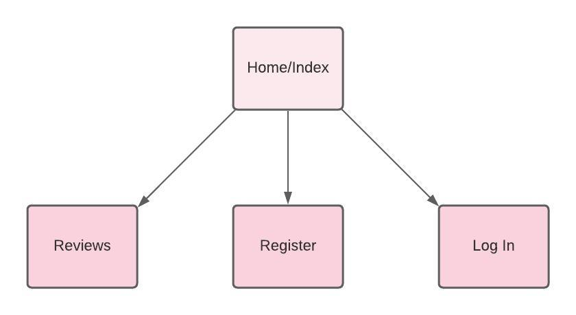

* A user who is not logged in, can reach four pages;
* Home / Index
* Reviews - Cannot upload a review.
* Register 
* Log In 

**As A Registered User (Logged In)** 

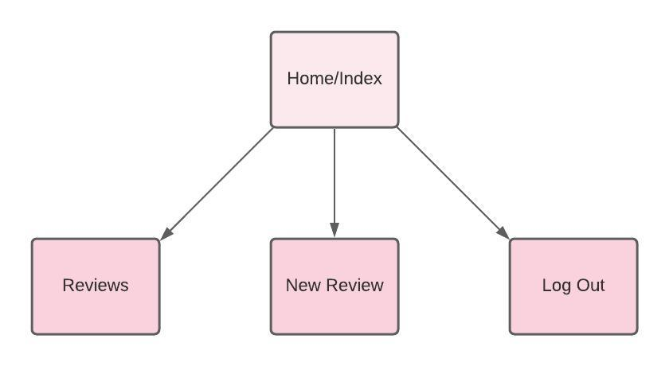

* A user who is logged in, can reach four pages;
* Home / Index 
* Reviews - Can edit or delete own reviews.
* Edit Review 
* Log Out

**For All Users**

* The Navbar provides access to these pages on all devices. This Navbar collapses to a Side Navbar on mobile devices.
* The Footer contains Social Media links which the site owner can use to link to their accounts.

**Database Schema** 

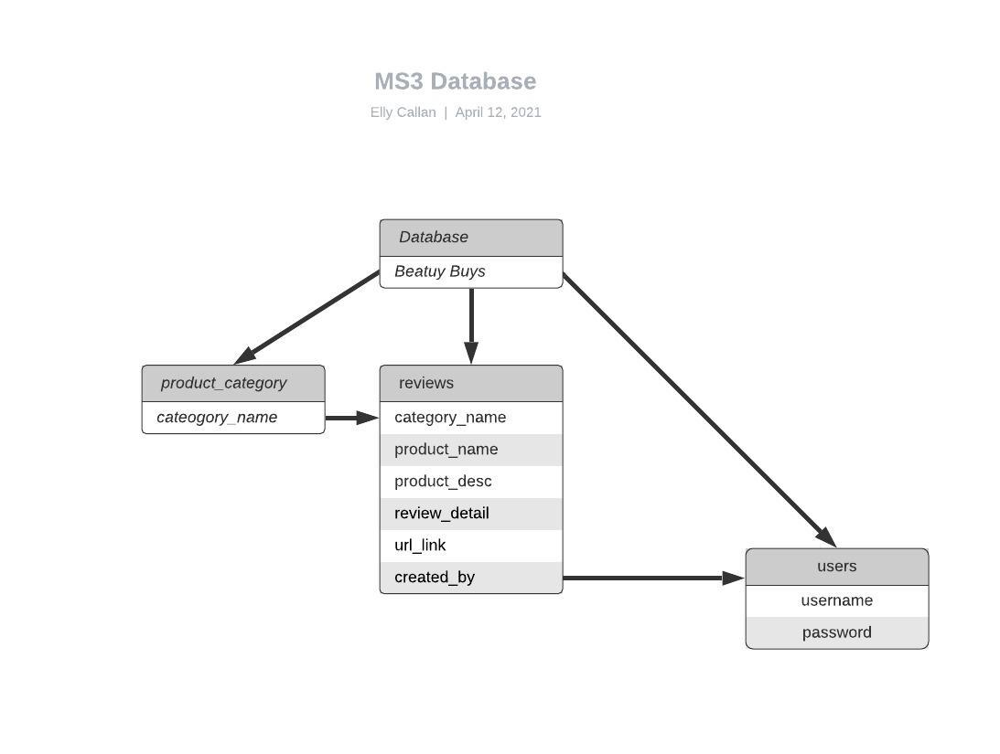

The Database is outlined as above. The database is named "Beauty Buys". Within the database are three collections, "product_category", "reviews" and "users". "product_category" holds four documents which are named "Facial Skincare", "Haircare", "Makeup" and "Body Skincare". These are the options the user has to choose from for "Category" when submitting a new review. This can be seen in the images below. 

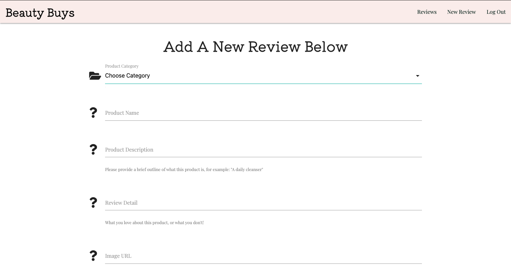
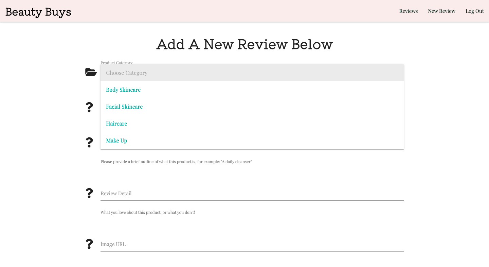

### 4.Skeleton

 Desktop wireframes can be viewed [here](readme-and-testing-images/ms3-desktop.pdf)

 * The first wireframe shows the homepage, as a user who is not logged in.
 * The second wireframe shows the homepage, as a user who is logged in.
 * The third and fourth wireframe shows the review page, as a user who is not logged in. 
 * The fifth wireframe shows the register page. 
 * The sixth wireframe shows the login page. 

 **When viewing the wireframes there are some changes that should be noted, they are detailed below.**
 
 * The Homepage wireframe, shows a button featured on the opening image. Once I had designed and implemented the Navigation
 Bar the button felt like an unneccessary feature. The purpose was to allow the user to click the button to register, but with 
 the user being able to select "Register" in the Nav Bar, this fulfilled this purpose.

 * The Reviews page differed from my original wireframe. In my wireframe I thought I would use an accordion element to display the reviews. This would have meant when the user opened the review page they would only have seen the product name and then expanded the rest of the review detail. Upon implementing I felt this didn't give the user a good experience, it wasn't visually appealing and I decided a card reveal would be better. By choosing to do this, the user visits the review page and is immediately shown a photo of the product being reviewed and the product name. The user can then expand this detail but rather than pushing the rest of the page down, the review slides up and the user can read the detail, close it and move on to the next review they would like to read. 

 * The implementation of both the Register and Login pages differed, the image to the top of the page felt more appropiate and followed conventional design along with the layout of the rest of the site.

### 5.Surface

**Colours**

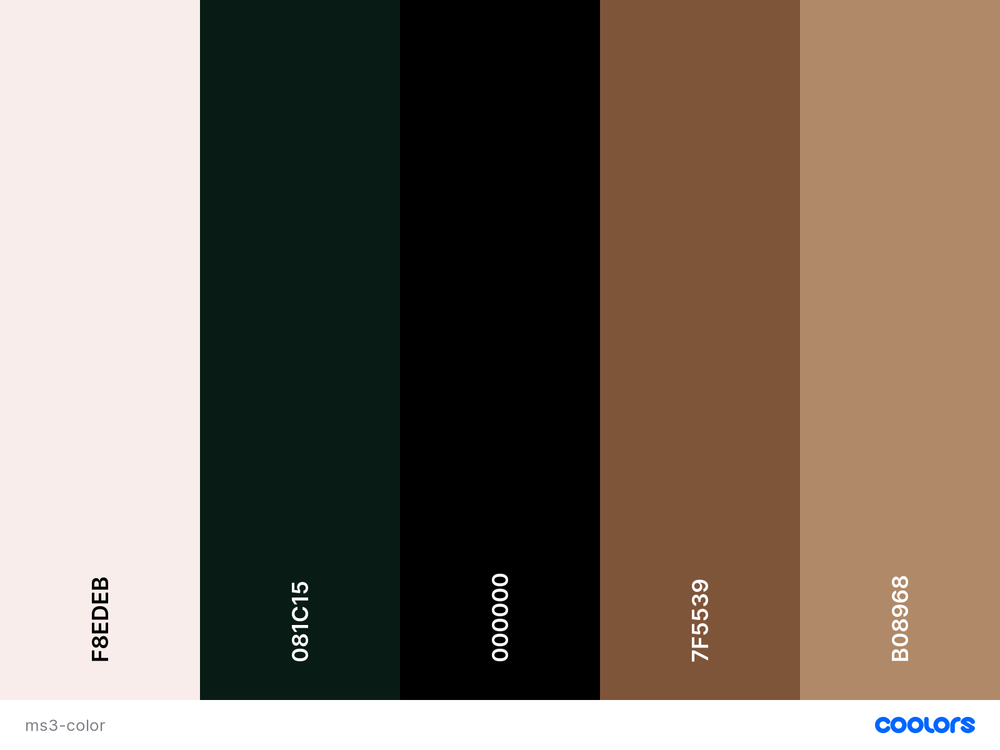

* The user sees the soft pink hue of the Home Page upon visiting the site. The pink was chosen to complement the main home image. The colour is gentle and doesn't detract from the aim of the site. 

* The two neutral tones are shown in my "Register" and "Log In" pages, and on the "Reviews" page. Neutral tones are well loved and appreciated within the beauty community, again they are subtle and allow the user to focus on the content. 

* The forest green creates a very subtle difference, when the user hovers over the navigational links the green turns to the classic black. 

**Font**

The two fonts included are "Kiwi Maru", a serif font and "Playfair Display" also a serif. 

"Kiwi Maru" can be seen in the brand name, any H1's and also within the card reveal of reviews. 

The remainder of the text is "Playfair Display". The two complement each other nicely, when choosing them I used Google Fonts and typed in the brand name to see how it would look in all of the fonts. Once I chose "Kiwi Maru" I then looked at the recommended pairings and chose "Playfair Display".

**Images**

There are two main images on the site. One is on the "Homepage" while the other is on both the "Registration" and "Log In" pages. 

The first image, on the homepage has soft, complimentary colours. The image is welcoming and showcases a sense of happiness and joy. 
The second image is very important as it shows an inclusive group, letting the user know that anyone is welcome to join the community. 

 

## Features 

### CRUD 

The main focus of this project is providing CRUD functionality while maintaining a database. CRUD is represented and shown in the following ways.

**Create** 

The user has the ability to complete a form to create a record in the database. In this case, the record created is a review and the user fills in appropiate information relating to a product of their choice. 

**Read** 

The user can visit the "Reviews" page and read all reviews made, both by themselves and others. 

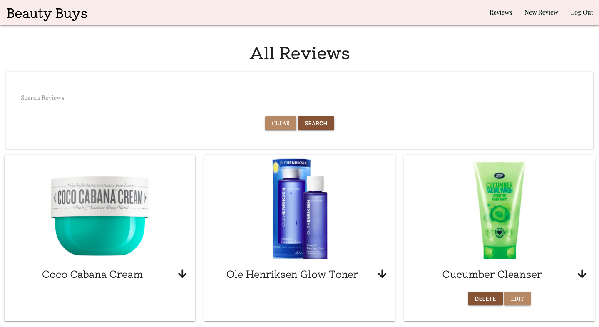

**Update**

Once the user has uploaded a review, they will be able to see two buttons on their own reviews. These two buttons are "Edit" and "Delete. The "Edit" button, provides the update functionality.

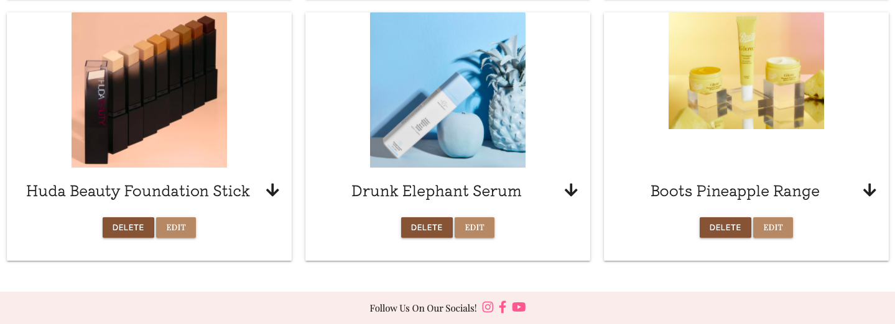

When the user chooses "Edit" they will be shown the following form which will allow them to update the data held in the database. They will be shown the data they've previously provided and they can update this as they wish. 

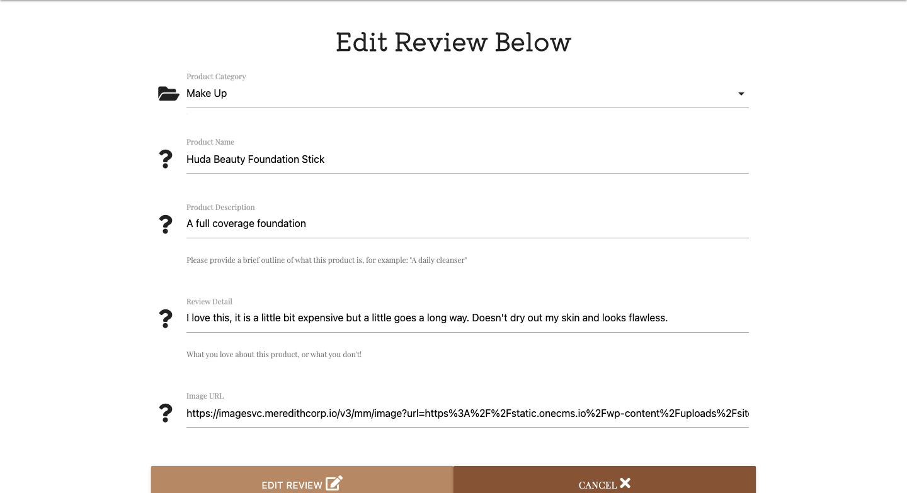

Updated review detail: 

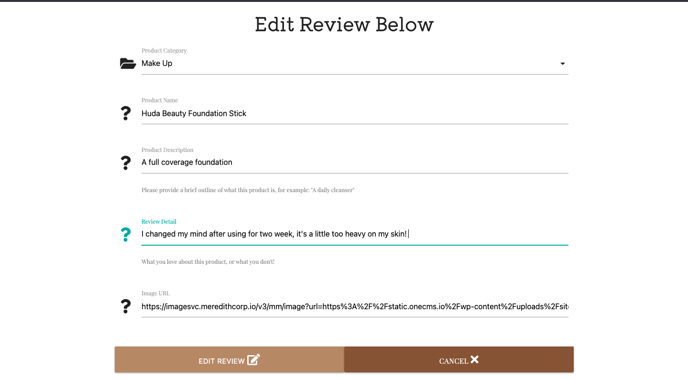

The user is then shown a flash message confirming the updating of the review.

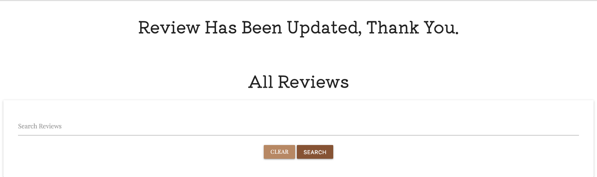

**Delete**

As mentioned above, the user who has created the review can view an "Edit" button and a "Delete" button. 

When the user chooses "Delete" they will be prompted to confirm that this is what they wish to do. 

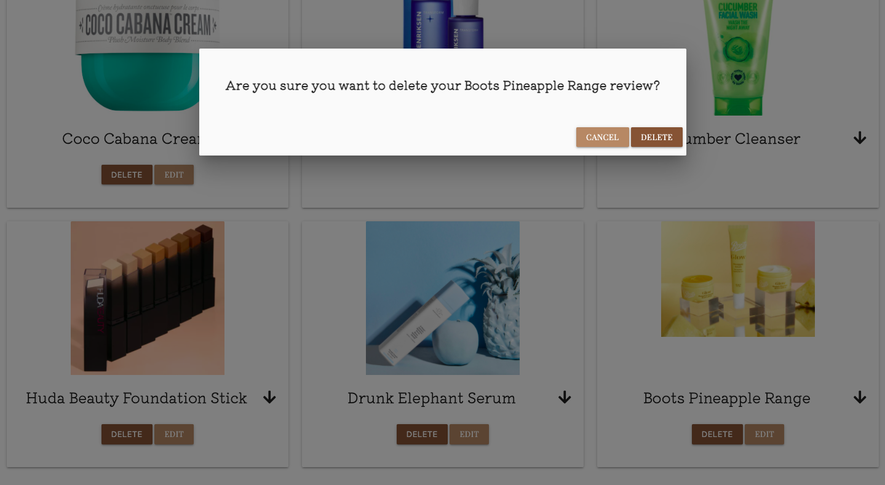

If the user chooses "Cancel" form this modal, they will simply be returned to the "Reviews" page. If they choose "Delete" their review will be deleted from the database and they will be shown a confirmation flash message of this. 

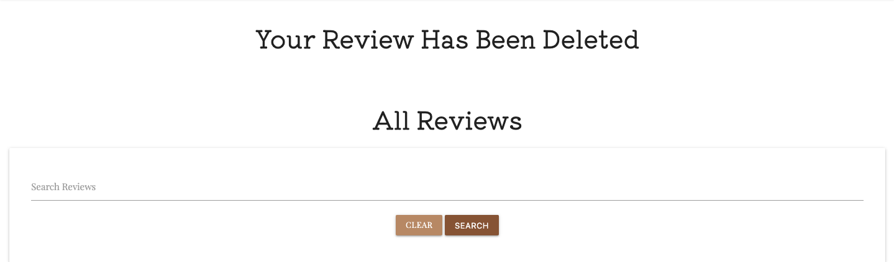

### Current Features 

* A fixed Navbar, that collapses on medium devices and below to a hamburger menu. The mobile navbar features a "Home" option as on extremely small device sizes, the user faced difficulty in clicking to the side of the menu to collapse it again. 

* A welcoming "Home Page", detailing the sites purpose and how to use it. The "Home Page" features a carousel of product images that encourage the user to visit the review page to find out about the products.

* A Footer, features links to all social media accounts.

* The "Reviews" page has a search function, the function checks the product name, the product description and review detail for the keyword the user is looking for. If a product is found, the result(s) are displayed. If there are no results, the user will be informed of this. 

* The reviews are displayed in card reveals, when visiting the "Reviews" the user sees an image and product title, the user can then choose which review they wish to expand the detail of. 

* A form allowing the user to upload reviews, the same form is utilised when a user wants to edit a review. 

* A form allowing the user to register, or log in if they have previously registered. 

### Feautures To Be Implemented

* In the future a feature could be added where a user could use their smartphone camera to scan a products barcode to provide product name 
  and details quickly, then they would only need to upload a reiew. 

* A community forum, where users could reach out to each other and discuss products.

* An option to sign up for a newsletter, which would inform the user of new reviews added. 

* The site could be developed to the point of being a mobile app, providing ease of use and accessibility. 

 

## Languages Used 

* [HTML5]()
* [CSS3]()
* [Python]()
* [jQuery]()

## Frameworks And Libaries & Other Tools Used 

* [Gitpod]()
* [Github]()
* [Git]()
* [Google Fonts]()
* [TinyPng]()
* [Balsamiq]()
* [MongoDb]()
* [Heroku]()
* [Jinja]()
* [Flask]()
* [Werkzeug]()
* [Coolors](https://coolors.co/palettes/trending)
* [Font Awesome]()
* [cdnjs]()
* [Conventional Commits](https://www.conventionalcommits.org/en/v1.0.0/)
* [Lucidchart](https://www.lucidchart.com/pages/) - For images used in "Structure" section of README.

 

## Testing 

Link to TESTINGMD here. 

## Deployment 

 

## Credits 

### Content 

### Media 

* My homepage image is from Pexel and can be found [here.](https://www.pexels.com/photo/happy-woman-removing-face-mask-after-taking-bath-3852159/)
* The image on my register and login pages is from PngKey, which can be found [here.](https://www.pngkey.com/detail/u2e6q8o0y3w7e6t4_customer-clipart-client-happy-cartoon-image-of-people)

### Acknowledgements