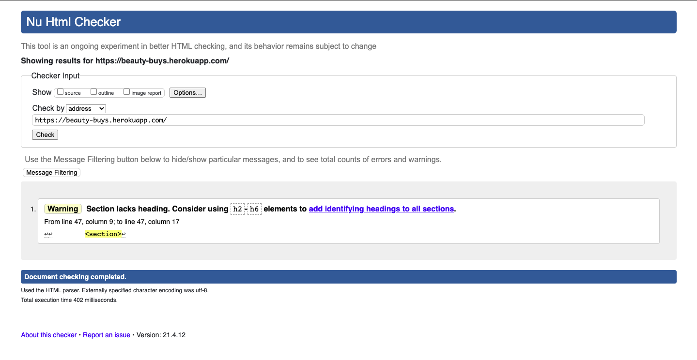
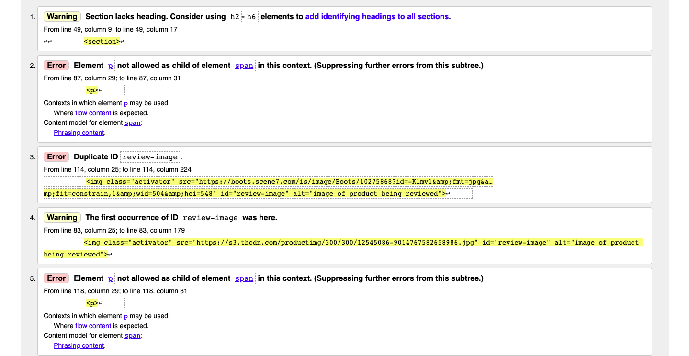
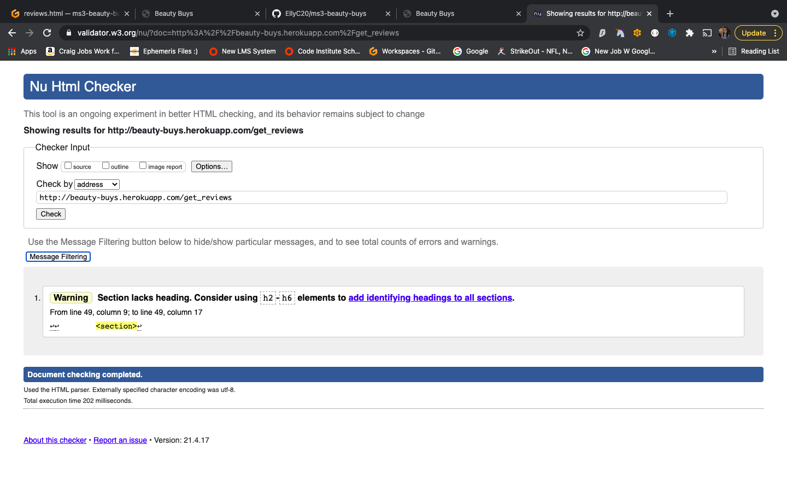
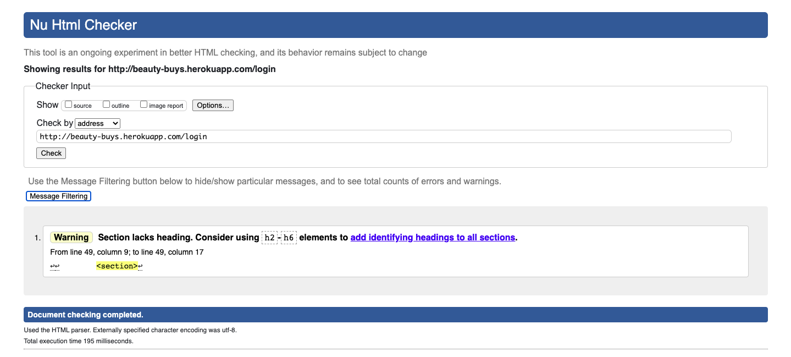
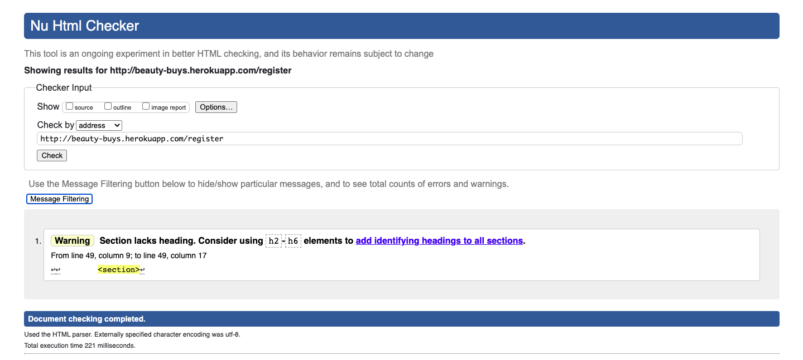
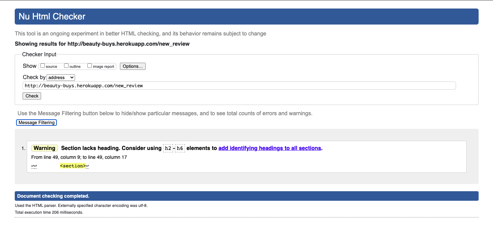
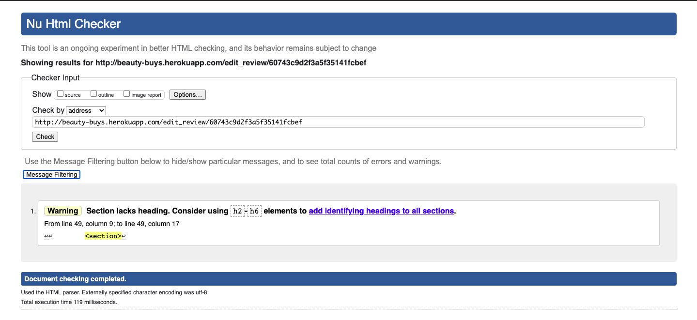
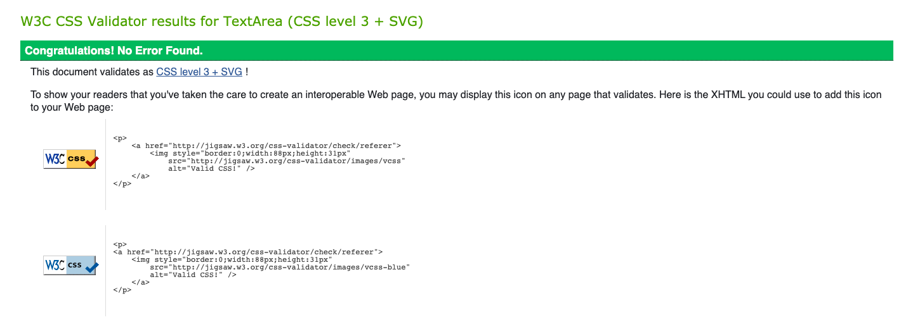
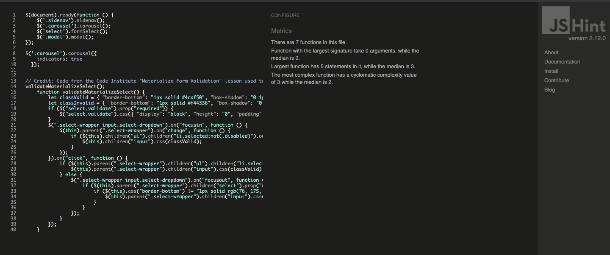
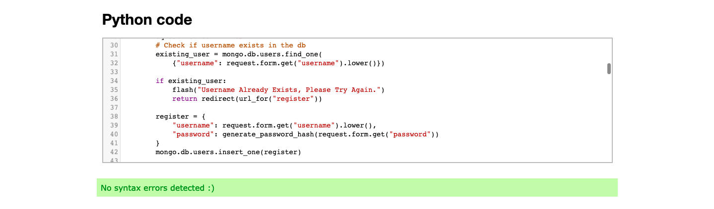

# Beauty Buys Testing 

## Validators 

**[HTML Validator](https://validator.w3.org/)**

To validate the HTML, the deployed URL for each page was tested. Listed below are any issues encountered, and fixes. There is one reoccuring error message, the error relates to <section> within the base.html. This is the area that contains my flash messages, therefore this error may be ignored in this case. 

**Home**

**Reviews** 

As seen below, errors occured due to two things. The use of "ID" on the review image caused an error, the validator was noting there were multiple elements with the same ID. To fix this I changed the ID to a class. Secondly, the use of a 
 tag within a span was incorrect and affecting the flow of the page. I removed the 
 tag and ensured the span held the same styling as I had intended, this solved the error.

**Log In**

**Register**

**New Review**

**Edit Review**

**[CSS](https://jigsaw.w3.org/css-validator/)**

To validate CSS, the CSS code was copied and checked using direct input. This didn't result in any errors. 

**[JavaScript](https://jshint.com/)**

To validate JavaScript, the code was copied and checked using direct input. This didn't result in any errors.

**[Python](https://extendsclass.com/python-tester.html)**

To validate Python code, the code was copied and checked by direct input. No errors were found.

## Database Testing 

## Responsive Design

## Problems Encountered 

* While testing my "Reviews" page on multiple devices I noted while using an Ipad Pro that the edit and delete buttons escaped their card
container. To overcome this I used Google Chrome Developer Tools and inspected which element was causing this. I saw that that the card content had a predetermined padding, this was supplied by Materialize. I targeted the class within my CSS to fix the issue. 

* When testing the site using Google Lighthouse, within accessibility it was noted that the images used in the "Home Page" carousel did not have alt attributes, I added this to improve accessibility.