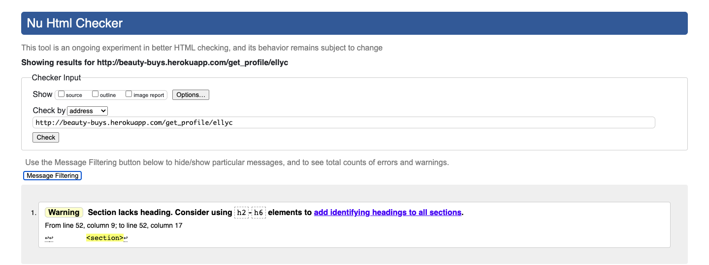
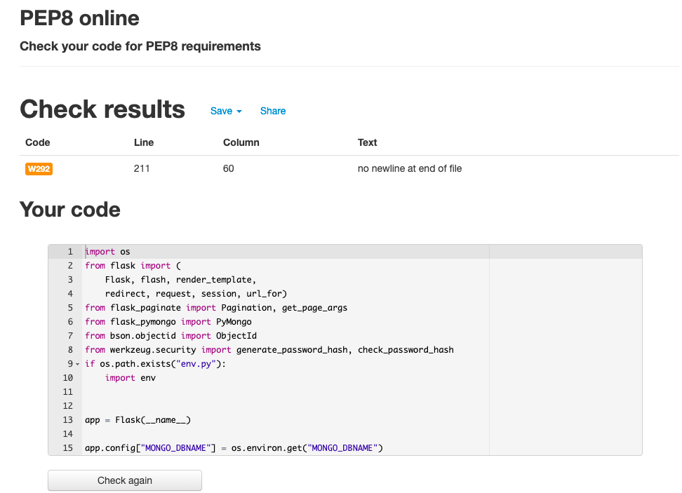
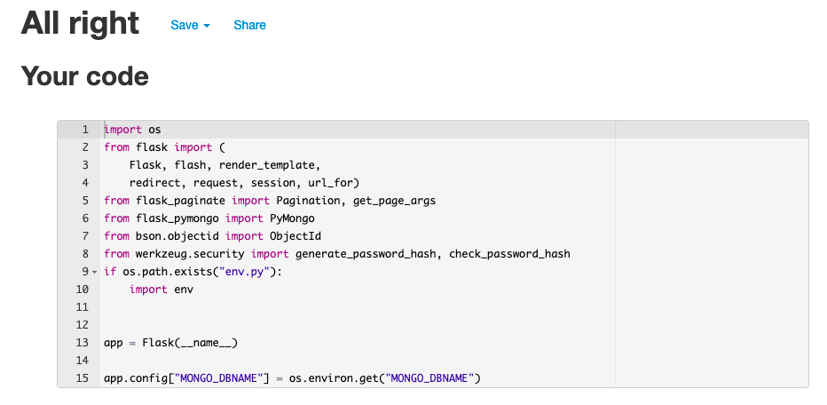
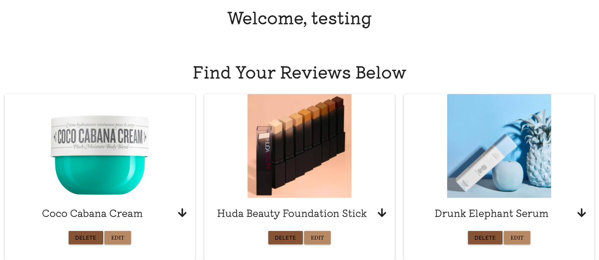

# Beauty Buys Testing 

## Validators 

**[HTML Validator](https://validator.w3.org/)**

To validate the HTML, the deployed URL for each page was tested. Listed below are any issues encountered, and fixes. There is one reoccuring error message, the error relates to a "section" within the base.html. This is the area that contains my flash messages, therefore this error may be ignored in this case. 

**Home**

**Reviews** 

As seen below, errors occured due to two things. The use of "ID" on the review image caused an error, the validator was noting there were multiple elements with the same ID. To fix this I changed the ID to a class. Secondly, the use of a "p" tag within a span was incorrect and affecting the flow of the page. I removed the "p" tag and ensured the span held the same styling as I had intended, this solved the error.

 

**Log In**

**Register**

**Profile**

**New Review**

**Edit Review**

**[CSS](https://jigsaw.w3.org/css-validator/)**

To validate CSS, the CSS code was copied and checked using direct input. This didn't result in any errors. 

**[JavaScript](https://jshint.com/)**

To validate JavaScript, the code was copied and checked using direct input. This didn't result in any errors.

**[Python](http://pep8online.com/)**

To validate Python code, the code was copied and checked by direct input. One error was noted, which can be seen below. I fixed this line error and validated my code for a second time. No errors were noted on the second check.

 

 

## Database Testing 

* When registering an account the username should be entered into the database and be visible. The password should also be entered but should be protected and not visible.
    - This was tested by registering an account and visiting MongoDB to visually inspect the results. This confirmed the expected behaviour.
* Once completed the "New Review" form, the information should enter the database and be saved within the appropiate collection. This review should then be displayed on the review page with the correct information.
    - To test this, a review was completed on the "New Review" page. I then visited MongoDB and confirmed the data had been entered correctly. I then returned to the site to view the "Reviews" page and ensure the correct information was being displayed to users. 
    This confirmed the expected results.
* If a user chooses to edit a review, the user should be presented with a prepopulated form containing the information they previously submitted. Upon editing and confirming the edit, the data should alter within the database and within the "Reviews" page. 
    - To test this, I clicked the edit button on a review I had made. I was shown a form containing the correct information that I had provided previously. Once I had completed the detail to be edited I confirmed this and visited the reviews page. This confirmed the data had been visually updated. I then checked within the database within MongoDB, this also confirmed the expected results.
* If a user chooses to delete a review, they should be asked to confirm that they wish to proceed. If they confirm the review should be removed from both the database and the site.
    - To test this I clicked the delete button on a review I had made. A modal popped up and I had to confirm I wished to proceed. Within this modal the question specifically asks if you wish to delete the review made of "x" product, where x is the product name. Once I confirmed, the review was removed from the site. I then visited MongoDB to ensure the data had been removed from the database, this confirmed the expected results.
 
 

## Defensive Design Testing

* Users cannot brute force onto a page they should not be able to access. A custom 404 message is in place for if the user attempts to access a page they should not have access to.
* Form validation within Register, Log In, New Review and Edit Review means that certain criteria must be met for the user to continue further. These patterns include not accepting lone spaces, that usernames and passwords must not have any spaces, the forms accept letters and numbers in some cases, along with commonly used punctuation in others. 
* For the uploading of a review image, only URL's that start with http:// or https:// are accepted.
* When logging in, if the user inputs an incorrect username or password they are not informed which one is incorrect. This is good pratice and helps protect the users account from potential security risks.
* A user can't delete a review with one click, there is a modal in place to confirm the request made. If the user confirms, the review is then deleted.
* Users cannot break the site by clicking buttons or external links, for example social media icons. All buttons are working as they should and provide the expected results.

## Testing User Stories 

Below there are supporting images for each user story to demonstrate how that requirement is fulfilled.

**As a User**

1. 
    - "I want to have the functionality to register an account." 

**A user can register an account using the "Register" page.**

2. 
    - "I want to be able to upload a review for different product categories."

**Within the "New Review" page, a user who has an account can submit the below form to submit a review.**

3. 
    - "I want to be able to read reviews left by other users."

**On the "Reviews" page any user can read the previous reviews left.**

4. 
    - "I want to be able to delete or edit a review I have made."

**Once signed in, a user can see an edit button on a review they have made. When they click edit they can change any of the information previously provided.**

 

5. 
    - "I don't want other users to be able to edit or delete a review I have made."

**As mentioned above, only when a user signs in do they get access to edit or delete. They may only edit or delete their own reviews.**

6. 
    - "I want to be able to search for particular products."

**A search bar provides the option to search by keyword. If there is a result it will be shown, otherwise a flash message is shown.**

 

**As a Site Owner**

1. 
    - "I want to provide a way for users to register an account."

**The "Registration" page provides this function**

2.  
    - "I want the users to have an easy and clear way of submitting a product review."

**The form is simple and explains what information is expected.**

3. 
    - "I want to provide a functionality where users can provide an image of the product being reviewed."

**Within the form, there's an input section which allows the user to upload a URL link**

4. 
    - "I want to have an admin account, this will ensure I can regulate reviews and remove any inappropiate content." 

**There's an admin account which has access to all reviews. The navigation menu option "Manage Reviews" shows only for the admin user, the admin can then visit this page and edit or delete reviews.**

 

**As A Returning User**

1. 
    - "I want to be able to easily sign into my account and see my own reviews."

**There is a simple design which ensures the user immediately knows where to go to log in. Upon visiting the Log In page and signing in, the user will be redirected to their profile. They will immediately see any reviews they have made. 

 

## Responsive Design

**Browser Compatibility** 

| Browser        | Google Chrome | Safari | Firefox | Microsoft Edge | Opera |
|----------------|---------------|--------|---------|----------------|-------|
| Responsiveness | Good          | Good   | Good    | Good           | Good  |
| Appearance     | Good          | Good   | Good    | Good           | Good  |

 

**Things To Note**

* On Safari and Firefox, the font is heavier within "Reviews" which makes it appear that the text colour is darker. On Firefox only, the colour palette of the navigation bar and the "Register" and "Log In" buttons, appears lighter.

 

**Responsiveness** 

* To test the below sizes, a combination of Google Chrome Developler Tools was used along with [Responsive Web Design Checker](https://www.responsivedesignchecker.com/)

**Large Device Sizes**

| Screen Size       | 1920 x 1080 | 1920 x 1200 | 1920 x 1080 | 1600 x 900 | 1440 x 900 |
|----------------|---------------|--------|---------|----------------|-----
| Renders As Expected | Yes | Yes  | Yes   | Yes  | Yes  |
| Images    | Good          | Good   | Good    | Good           | Good  |

 

**Medium Device Sizes**

| Screen Size       | 768 x 1024 | 1366 x 1024 | 600 x 960 | 1024 x 768 | 800 x 1280 |
|----------------|---------------|--------|---------|----------------|-----
| Renders As Expected | Yes | Yes   | Yes    | Yes | Yes |
| Images    | Good          | Good   | Good    | Good           | Good  |

 

**Small Device Sizes**

| Screen Size       | 320 x 568 | 414 x 736 | 360 x 640 | 411 x 731 | 280 x 653 |
|----------------|---------------|--------|---------|----------------|-----
| Renders As Expected | Yes | Yes   | Yes    | Yes | Yes |
| Images    | Good          | Good   | Good    | Good           | Good  |

 

**Features Testing** 

The testing of the **navigation bar** is applicable to all pages, as is the **footer**. 

**Home Page**

While testing the Home page I expect the following things to occur;

* The navigation bar should collapse to a mobile side navbar at any screen size below 993 px. 
    - This was tested using Google Chrome Dev Tools, an Iphone 8 and an Ipad Pro. These checks confirmed the expected behaviour. 

* The navigation bar should become fixed on smaller device sizes, specifically below 600px. 
    - To test this I used Google Chrome Dev Tools, and an Iphone 8. These checks on the Iphone showed an error that wasn't clear within Dev tools. While scrolling on the "Reviews" and "Profile" page, the nav disappeared behind the content. To fix this I altered the z-index of the navigation bar.

* The carousel should on touch screen devices be "finger scrollable". On desktop or devices without a touch screen function the user can click the image to scroll.
    - This was tested on a Macbook Air, an Ipad Pro and an Iphone 8. These checks confirmed the expected behaviour. 

* The footer should be visible and contain social media icons, clicking these should open a new tab with the relative social media website.
    - To test this I visited the deployed site and clicked the icons. Upon doing this I noted that I had mistakenly put the Facebook URL with the YouTube icon and the Youtube URL with the Facebook icon. I fixed this by updating the URL's for both icons. I checked the results again and got the expected results.

**Reviews**

While testing the Reviews page I expect the following things to occur;

* The search function should accept letters and numbers and not lone spaces. When a product is found from the keyword searched, it should be displayed. If there are no products matching the keyword search the user should be alerted to this. 
    - This was tested by visiting the deployed site and attempting to search for a product, an error occured which is detailed in problems encountered. Once fixed, I searched again and got the expected results. 
* There should be pagination at the bottom of the page displaying page numbers allowing the user to navigate easily. There should be six reviews per page. 
    - This was tested by visiting the deployed site and visually inspecting this. A visual inspection confirmed pagination was there. I added 5 "testing" reviews to ensure pages would be added as the reviews increased and this behaviour was confirmed. 
* There should be cards to display the review content, these should be expandable and "reveal" information. The user should also be able to close them. 
    - To test the Reviews page the deployed site was visited and I clicked the down arrow within the card to expand more. Upon doing this, the review information was revealed, to close the information I clicked the up arrow and the card collapsed. 

**Register**

While testing the Register page I expect the following things to occur;

* The user should be asked to provide a username and password. The username and password must match a pattern that accepts letters and numbers and no spaces.
    - This was tested by visiting the deployed site and attempting to input invalid usernames. I attempted to register a username with spaces only and this was not allowed.
    - I attempted to register a password with spaces only and this was not allowed.
    - I attempted to register a username and a password containing a space and this was not allowed.
* After a successful registration the user should be directed to their new profile. 
    - This was tested by registering an account on the deployed site and visually inspecting what happened. Once registered the user is taken to their profile with a flash message informing them their registration was successful. 
* A user should not be able to register an account with a username that is already registered. A flash message is expected to inform the user that this username is already in use, and they should be redirected to the register page again.
    - This was tested by visiting the deployed site and attempting to register with a username I already knew was in use. This confirmed the expected behaviour.

**Log Out**

While testing the Log Out function I expect the following things to occur;

* The user once registered or logged in can click log out. Once they click log out I expect the user to be logged out and taken to the "Log In" page with a flash message informing them that they have logged out. 
    - This was tested by visiting the deployed site, signing out and visually inspecting the resulting action. This confirmed the expected behaviour.

**Log In**

While testing the Log In page I expect the following things to occur;

* The user should be asked to input their username and password. If they are successful they should be taken to their profile, or if their username or password is incorrect they should be informed of this and redirected to the Log In page. 
    - This was tested by visiting the deployed site and attempting to sign in with a correct username and incorrect password, this resulted in a flash message stating "Incorrect Username And/Or Password". 
    - I then tried an incorrect username with a correct password, and recieved the same flash messsage. This is as expected, the user should not know if it is an incorrect username or password specifically at any point as this could lead to a security risk. 
    - The testing confirmed the expected behaivour. 

**Profile**

While testing the Profile page I expect the following things to occur;

* The user who is logged in should be shown their own reviews within their profile. The displayed reviews should have the option to edit or delete. 
    - This was tested by visiting the deployed site, signing in and visually inspecting the results. This confirmed the expected behaviors.
* By clicking the edit button the user should be taken to edit their review. 
    - This was tested by visiting the deployed site, signing in and visually inspecting the results. This confirmed the expected behaviors.
* By clicking the delete button the user should be asked do they want to delete the review. The user should be able to confirm or cancel the request. 
    - This was tested by visiting the deployed site, signing in and visually inspecting the results. This confirmed the expected behaviors.

**New Review**

While testing the New Review page I expect the following things to occur;

* A form to be available that allows the user to input specific information. Each section should be validated, required and only submit when all requirements are met. Once submitted this should then display on the reviews page and on the users profile. 
    - This was tested by visiting the deployed site, signing in and submitting a new review. This confirmed the expected behaviors.

**Manage Reviews - Admin Only**

While testing the Manage Reviews page I expect the following things to occur;

* The Manage Reviews navigation link should only be visible if the user signed in is the "admin" user. 
    - This was tested by visting the deployed site and signing in using the admin account. This confimed the expected results. 
* On the Manage Reviews page I expect as admin to be able to see all reviews and have the edit and delete buttons visible for all reviews.
    - This was tested by visting the deployed site and signing in using the admin account. This confimed the expected results. 
* When the edit button is chosen, Admin should be redirected to the "Edit Review" page.
    - Testing was done by signing in as admin and selecting this option, this confirmed the expected results.
* When the delete button is chosen, Admin should be prompted to confirm they wish to delete the review or be given the option to cancel. 
    - Testing was done by signing in as admin and selecting this option, this confirmed the expected results.

## Problems Encountered 

* While testing my "Reviews" page on multiple devices I noted while using an Ipad Pro that the edit and delete buttons escaped their card
container. To overcome this I used Google Chrome Developer Tools and inspected which element was causing this. I saw that that the card content had a predetermined padding, this was supplied by Materialize. I targeted the class within my CSS to fix the issue. 

* When testing the site using Google Lighthouse, within accessibility it was noted that the images used in the "Home Page" carousel did not have alt attributes, I added this to improve accessibility.

* When testing the search function of the review page I had not correctly implemented pagination within the search function. This resulted in an error when attempting to search for a product. The error was resolved by correctly updating the search function.

* Users were able to access pages they shouldn't have been able to once logged out. For example, the admin account is the only account that can visit the "Manage Categories" page. However, upon logging out if the user clicked the back button they would be returned to the "Manage Categories" page. This also occured for users who logged out and then pressed back, they could visit the "New Review" page and "Profile", both of which should not have been accessible.
    - To fix this I implemented "if" statements into the python functions to perform checks, this ensures that if a user attempts to brute force onto a page they shouldn't have access to, they will be shown a 404 error page. 