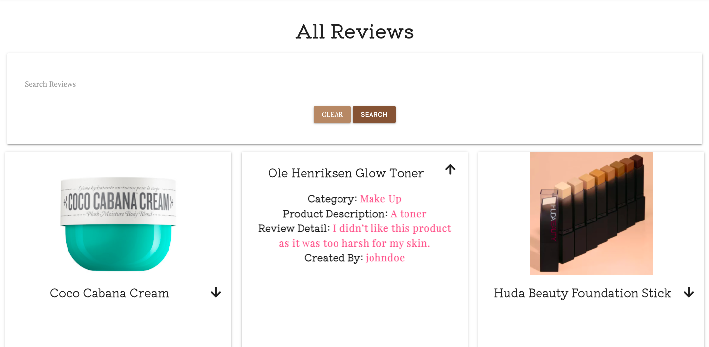
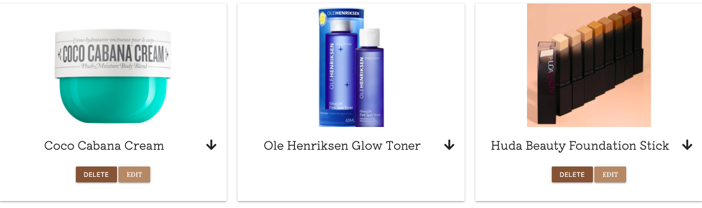
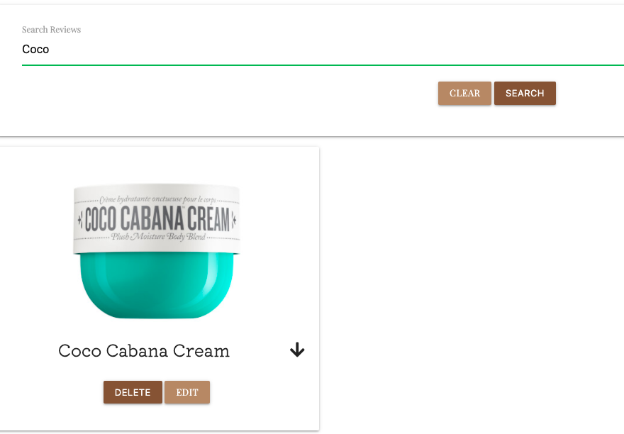
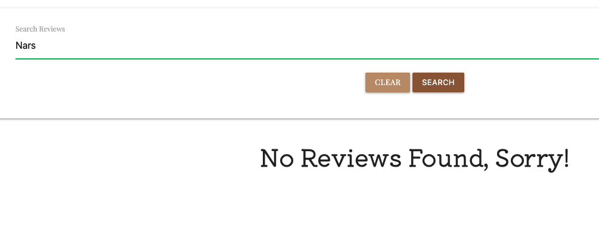

# Beauty Buys Testing 

## Validators 

**[HTML Validator](https://validator.w3.org/)**

To validate the HTML, the deployed URL for each page was tested. Listed below are any issues encountered, and fixes. There is one reoccuring error message, the error relates to a "section" within the base.html. This is the area that contains my flash messages, therefore this error may be ignored in this case. 

**Home**

**Reviews** 

As seen below, errors occured due to two things. The use of "ID" on the review image caused an error, the validator was noting there were multiple elements with the same ID. To fix this I changed the ID to a class. Secondly, the use of a "p" tag within a span was incorrect and affecting the flow of the page. I removed the "p" tag and ensured the span held the same styling as I had intended, this solved the error.

**Log In**

**Register**

**New Review**

**Edit Review**

**[CSS](https://jigsaw.w3.org/css-validator/)**

To validate CSS, the CSS code was copied and checked using direct input. This didn't result in any errors. 

**[JavaScript](https://jshint.com/)**

To validate JavaScript, the code was copied and checked using direct input. This didn't result in any errors.

**[Python](https://extendsclass.com/python-tester.html)**

To validate Python code, the code was copied and checked by direct input. No errors were found.

## Database Testing 

## Testing User Stories 

Below there are supporting images for each user story to demonstrate how that requirement is fulfilled.

**As a User**

* "I want to have the functionality to register an account." 

A user can register an account using the "Register" page. 

* "I want to be able to upload a review for different product categories."

Within the "New Review" page, a user who has an account can submit the below form to submit a review.

* "I want to be able to read reviews left by other users."

On the "Reviews" page any user can read the previous reviews left.

* "I want to be able to delete or edit a review I have made."

Once signed in, a user can see an edit button on a review they have made. When they click edit they can change any of the information previously provided.

* "I don't want other users to be able to edit or delete a review I have made."

As mentioned above, only when a user signs in do they get access to edit or delete. They may only edit or delete their own reviews.

* "I want to be able to search for particular products."

A search bar provides the option to search by keyword. If there is a result it will be shown, otherwise the below flash message is shown.

**As a Site Owner**

* I want to provide a way for users to register an account.

* I want the users to have an easy and clear way of submitting a product review. 

* I want to provide a functionality where users can provide an image of the product being reviewed. 

* I want to have an admin account, this will ensure I can regulate reviews and remove any inappropiate content. 

## Responsive Design

| Browser        | Google Chrome | Safari | Firefox | Microsoft Edge | Opera |
|----------------|---------------|--------|---------|----------------|-------|
| Responsiveness | Good          | Good   | Good    | Good           | Good  |
| Appearance     | Good          | Good   | Good    | Good           | Good  |

**Things To Note**

* On Safari and Firefox, the font is heavier within "Reviews" which makes it appear that the text colour is darker. On Firefox only, the colour palette of the navigation bar and the "Register" and "Log In" buttons, appears lighter.

## Problems Encountered 

* While testing my "Reviews" page on multiple devices I noted while using an Ipad Pro that the edit and delete buttons escaped their card
container. To overcome this I used Google Chrome Developer Tools and inspected which element was causing this. I saw that that the card content had a predetermined padding, this was supplied by Materialize. I targeted the class within my CSS to fix the issue. 

* When testing the site using Google Lighthouse, within accessibility it was noted that the images used in the "Home Page" carousel did not have alt attributes, I added this to improve accessibility.